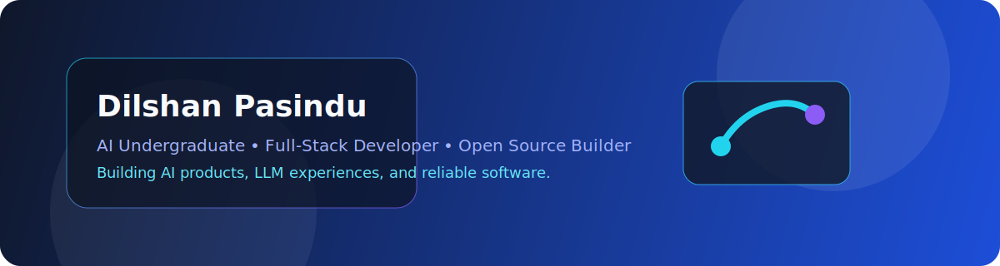

# 👋 Hello, I'm Dilshan Pasindu

  

  

  

## 🚀 About Me

I am an Artificial Intelligence undergraduate with a strong passion for building intelligent systems, intelligent products, and modern software experiences. My interests span AI, Machine Learning, Deep Learning, RAG, LLMs, Computer Vision, cloud technologies, and end-to-end software engineering. I enjoy turning ideas into reliable, polished applications and continuously learning across the full stack.

## 🧠 AI Expertise

  
  
  
  
  
  
  
  

## 🛠️ Tech Stack

### Programming Languages

  

### Frontend

  

### Backend

  

### AI / Data

  

### Databases & Cloud

  

## 📊 GitHub Analytics

  
  

  

  

  

## 🚀 Featured Projects

| Project | Description | Tech Stack |
|---|---|---|
| DP Bot | A rule-based AI chatbot built in Python with memory, games, calculator, and history features. | Python, JSON, CLI |
| AI Research Paper Summarizer | A project focused on summarizing research papers and extracting useful insights. | Python, NLP, Automation |
| Medical Appointment Scheduling System | A practical solution for clinics and appointment scheduling workflows. | Java, Spring Boot, Database |
| Vehicle Repair Management System | A management system for vehicle maintenance and repair operations. | Java, Full Stack |

## 🎯 Current Focus

Building AI applications, LLM-powered systems, RAG experiences, deep learning experiments, and scalable backend solutions while contributing to meaningful open-source and real-world projects.

## 🏆 Achievements

- GitHub Trophies
- Open Source Contributions
- Building production-minded projects
- Continuous learning in AI and software engineering

## 🌐 Connect

  
  
  
  

## ☕ Fun Section

  

  

## 🐍 Contribution Snake

  

  

  <b>Thanks for visiting my profile — let's build something amazing together.</b>

